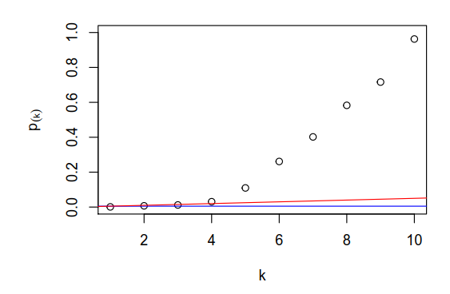
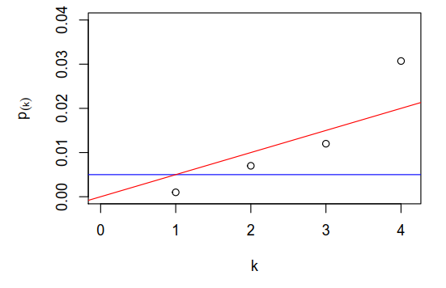
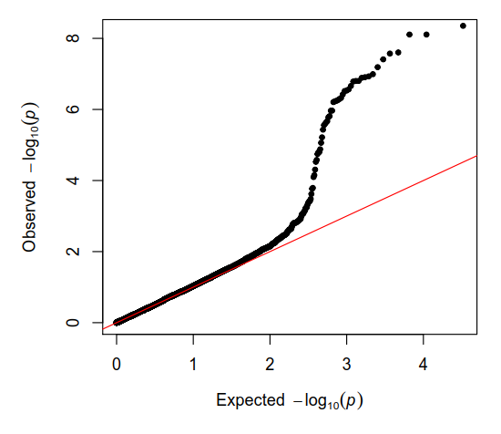
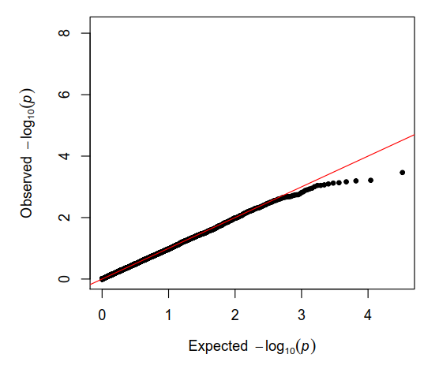

<h5 align="center">
   
</a>
 
</h5>

<h4 align="center">A toolkit for adjusting and visualizing p values</a>.</h4>

<h5 align="center">
Created by</a></h5>

<h4 align="center">

[Amy Goldlist](https://github.com/amygoldlist) &nbsp;&middot;&nbsp;
[Esteban Angel](https://github.com/estebanangelm) &nbsp;&middot;&nbsp;
[Veronique Mulholland](https://github.com/vmulholl)
</a></h4>

 
<h4 align="center">

&nbsp;&nbsp;&nbsp;&nbsp;&nbsp;&nbsp;
&nbsp;&nbsp;&nbsp;&nbsp;&nbsp;&nbsp;
&nbsp;&nbsp;&nbsp;&nbsp;&nbsp;&nbsp;

</a></h4>

<h1></h1>
<h4 align="center">
  <a href="#key-features">Key Features</a> &nbsp;&nbsp;&nbsp;•&nbsp;&nbsp;&nbsp;
  <a href="#install">Install</a> &nbsp;&nbsp;&nbsp;•&nbsp;&nbsp;&nbsp;
  <a href="#how-to-use">How To Use</a> &nbsp;&nbsp;&nbsp;•&nbsp;&nbsp;&nbsp;
  <a href="#credits">Credits</a> &nbsp;&nbsp;&nbsp;•&nbsp;&nbsp;&nbsp;
  <a href="#related">Related</a> &nbsp;&nbsp;&nbsp;•&nbsp;&nbsp;&nbsp;
  <a href="#license">License</a>
</h4>
<h1></h1>

 

## Key Features

p_toolkit is a package designed to help adjust and visualize p-values when using multiple comparisons.  As computing power has become powerful enough to run hundreds or even thousands of statistical tests, it is important to look at small p-values and try to understand whether the result is small simply by chance, or whether it truly is significant.  There are many tools to help decide when to reject a Null hypothesis, which can control either:

*  The chance of committing a type 1 error (rejecting a null hypothesis given that it is true) on a single test
* The chance of committing at least one type 1 error in *m* tests
* The chance of a null hypothesis being true given that we have rejected it, the False Discovery rate (FDR)

We can use the p-values alone, or an adjustment method such as the Bonferroni  or the Benjamini-Hochberg (BH) methods.  We can also use visualization methods such as QQ-plots or a scatter plot of the p-values, to try and detect patterns.

This package aims to combine these methods in a simple-to-use format, which works by outputting dataframes, which contain results from several adjustment methods.

### Package Functions
The following table gives a high level overview of the proposed functions in `p_toolkit`.

| Functions    | Description                                         | Inputs                           | Outputs                                               |
|--------------|-----------------------------------------------------|----------------------------------|-------------------------------------------------------|
| `p_methods`  | Bonferroni, BH summary of adjusted pvals            | df/vector, p-value column, alpha | DATAFRAME  variable, raw pval, adjusted pvals      |
| `p_adjust`   | Correction method specific output                   | df/vector, p-value column, alpha | raw pval, adjusted pval, Significance, Critical value |
| `p_plot`     | Summary plot comparing methods - sample from DSCI553 Lecture 2:   `par(mfrow=c(1,2))` `plot(1:10, sort(p.ex1), ylim=c(0,1),`  `xlab="k", 'ylab=expression(p[(k)]))`   `abline(h=.05/10, col="blue"); abline(c(0,.05/10),col="red")` `plot(1:10, sort(p.ex1), xlim=c(0,4.1),ylim=c(0,.04),` `xlab="k", ylab=expression(p[(k)]))` `abline(h=.05/10, col="blue"); abline(c(0,.05/10),col="red")`                      | `p_methods` dataframe                  |  |
| `p_qq`       | qq plot labeling per method the significant pvals   |      `p_methods` dataframe                                     |   |
| *`p_matrix`  | Confusion matrix with FDR (reverse of type I error) |         _TBD_                              |                             _TBD_                          |
| *`p_summary` | Summary listing  FDR rate                           |        _TBD_                               |                                            _TBD_                |

 \* Bonus functions for data with labels

## Install

## How To Use

## Credits

* README formatting inspiration from  [Markdownify](https://github.com/amitmerchant1990/electron-markdownify/blob/master/README.md#key-features)
* Badges by [Shields IO](https://shields.io/)
* Logo by [Devendra Karkar](https://www.iconfinder.com/dev-patel)

## Related

### Package Dependencies

### Similar Packages and Functions

Some packages already exist for the p-value adjustment in both environments, R and Python:

**R:**

* [`stats::p.adjust`](https://www.rdocumentation.org/packages/stats/versions/3.4.3)

The `p.adjust` function comes in the base `stats` library in R. It's a function designed for adjusting an array of p-values using six methods, some for controlling the family-wise error ("holm", "Hochberg", "Hommel", "Bonferroni") and the others for controlling the false discovery rate ("BH", "BY","fdr"). The advantage of this function is its simplicity and that it comes in the `stats` library, which is built in in the default environments in R, so the user doesn't need to install external packages. It doesn't let the user analyze deeper what is going on with the tests; this is a key element of `p_toolkit`.

* [`fdrtool`](https://www.rdocumentation.org/packages/fdrtool/versions/1.2.15)

`fdrtool` is a package designed for analyzing the False Discovery Rate in statistical tests and not limited exclusively to p-value adjustment. Has some functions related to `p_toolkit` like `fdrtool`, which calculates and plots the false discovery rate and `pval.estimate.eta0`, which outputs the proportion of null p-values in a list.

**Python:**

* [`statsmodels.sandbox.stats.multicomp.multipletests`](http://www.statsmodels.org/devel/generated/statsmodels.sandbox.stats.multicomp.multipletests.html#statsmodels.sandbox.stats.multicomp.multipletests)

This function is part of the `statsmodels` library, a complete set of functions for implementing statistical methods in Python. It works similar to R's `p.adjust`, receiving an array of p-values as inputs and returning two arrays: one with the corrected p-values and another one with boolean values corresponding to the new logical values after correction. It has no diagnostics and analysis of the results.

## License

[MIT License](https://github.com/UBC-MDS/p_toolkit_R/blob/master/LICENSE)

Interested in contributing?
See our [Contributing Guidelines](https://github.com/UBC-MDS/p_toolkit_R/blob/master/CONTRIBUTING.md) and [Code of Conduct](https://github.com/UBC-MDS/p_toolkit_R/blob/master/Conduct.md).

---
<h6 align="center">
Created by

[Amy Goldlist](https://github.com/amygoldlist) &nbsp;&middot;&nbsp;
[Esteban Angel](https://github.com/estebanangelm) &nbsp;&middot;&nbsp;
[Veronique Mulholland](https://github.com/vmulholl)
</a></h4>
